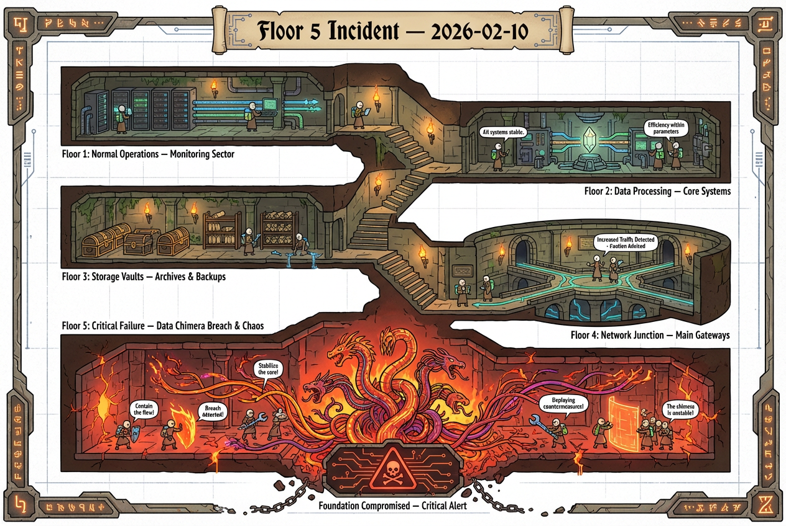
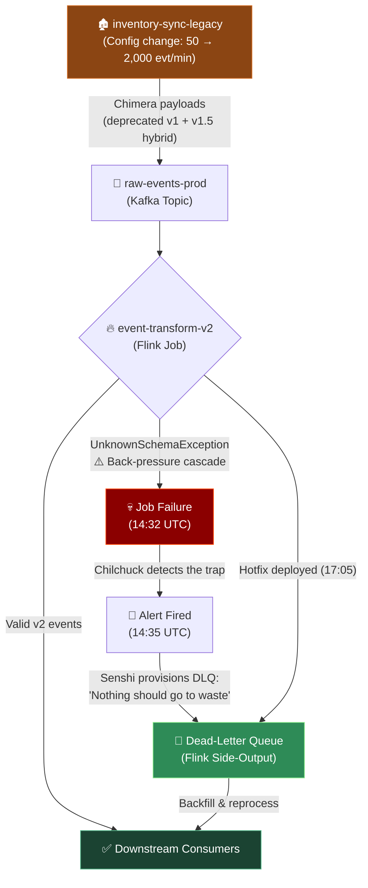

# Post-Mortem: Floor 5 Incident (2026-02-10)

## Incident Map

## Summary

On February 10th at 14:32 UTC, the Aurora Platform's stream processor encountered a catastrophic failure when attempting to ingest a previously unseen payload type. The incident lasted approximately 3 hours and affected all downstream consumers. No data was permanently lost, though several team members reported feeling drained.

## Timeline

| Time (UTC) | Event |
|------------|-------|
| 14:32 | Flink job `event-transform-v2` begins throwing `UnknownSchemaException` on topic `raw-events-prod` |
| 14:35 | Automated alerting fires. On-call engineer (Chilchuck) acknowledges the page |
| 14:41 | Chilchuck identifies the source: a legacy producer is emitting events with a deprecated nested schema. Describes it as "a trap we should have seen coming" |
| 15:10 | Laios joins the call and suggests we simply consume the malformed events as-is, noting they "look perfectly fine if you break them down properly" |
| 15:25 | Marcille vetoes the approach, citing potential data corruption and long-term schema contamination |
| 15:48 | Senshi provisions a temporary dead-letter queue, remarking that "nothing should go to waste" |
| 16:20 | Team Kabru offers to take over incident command. Offer is politely declined |
| 17:05 | Hotfix deployed: malformed events are routed to DLQ with a new Flink side-output |
| 17:30 | All systems nominal. Backfill of DLQ events begins |

## Incident Flow

The following diagram illustrates how the chimera payload propagated through the system and how the party — *team* — contained it.

## Root Cause

A producer service (`inventory-sync-legacy`) was never migrated to the v2 event schema. During a routine config change, its throughput increased from ~50 events/min to ~2,000 events/min, overwhelming the Flink job's error handling path.

The schema in question was a chimera — a hybrid of two deprecated formats fused together during a previous migration that was never fully completed. It had been lurking in production at low volume for months.

## Impact

- **Events delayed:** ~180,000 events were buffered in Kafka during the outage window
- **Dashboard downtime:** Grafana dashboards showed stale data for 2.5 hours
- **Consumer lag:** Took an additional 45 minutes post-fix to fully catch up
- **Morale:** Team Touden missed their lunch break

## What Went Well

- Alerting fired within 3 minutes of the first error
- Dead-letter queue was provisioned quickly, preventing any data loss
- Senshi's suggestion to preserve all events for later reprocessing proved invaluable
- The party — sorry, the *team* — coordinated effectively across time zones

## What Could Be Improved

- The legacy producer should have been identified during the original migration. We need a dungeon map — that is, a comprehensive **service dependency graph** — to avoid similar surprises.
- Flink job error handling was too aggressive: a single bad record type caused the entire job to back-pressure. We should implement per-record error isolation.
- Runbook for this scenario did not exist. Chilchuck notes we "went in without a plan, as usual."

## Action Items

| # | Action | Owner | Due |
|---|--------|-------|-----|
| 1 | Migrate `inventory-sync-legacy` to v2 schema | Team Touden | March 2026 |
| 2 | Add per-record error isolation to Flink jobs | Team Touden | March 2026 |
| 3 | Build service dependency graph (all floors) | Team Kabru | April 2026 |
| 4 | Write runbook for schema-mismatch incidents | Chilchuck | March 2026 |
| 5 | Audit all producers for deprecated schemas — leave no monster unturned | Senshi | April 2026 |
| 6 | Evaluate Marcille's proposal for automated schema evolution with backward compatibility enforcement | Marcille | May 2026 |

## Lessons Learned

> "You can't just skip the floors you don't like. Every layer of the system needs to be understood before you can safely go deeper." — Laios, during retro

The incident reinforced the importance of completing migrations fully rather than leaving legacy systems running at low volume. What seems harmless at 50 events/min becomes a serious hazard at 2,000.

---

*Prepared by: Senshi, Platform Team*
*Reviewed by: Laios, Marcille, Chilchuck*
